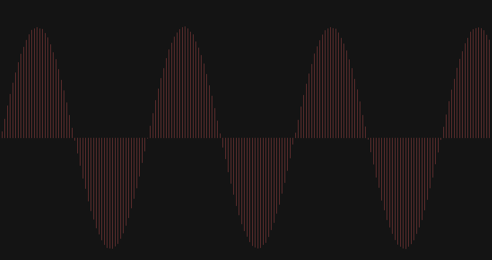

# Visualise Waves

- Fourier transform signal and visualise with [SDL3](https://github.com/libsdl-org/SDL)
- also using Emscripten to compile it so WASM

## Usage
```bash
make # native using gcc
make emscripten # web using emcc
```
## [readWAV](./src/readWAV.c)



- simple program for reading and visualising a WAV file
- Mouse wheel to zoom

```bash
gcc readWAV.c -lSDL3 -lm -o readWAV
```

## Notes

- [WAV Header format](https://en.wikipedia.org/wiki/WAV:~:text=WAV%20file%20header)
- [RIFF and WAV reference (IBM/Microsoft)](https://www.aelius.com/njh/wavemetatools/doc/riffmci.pdf)
