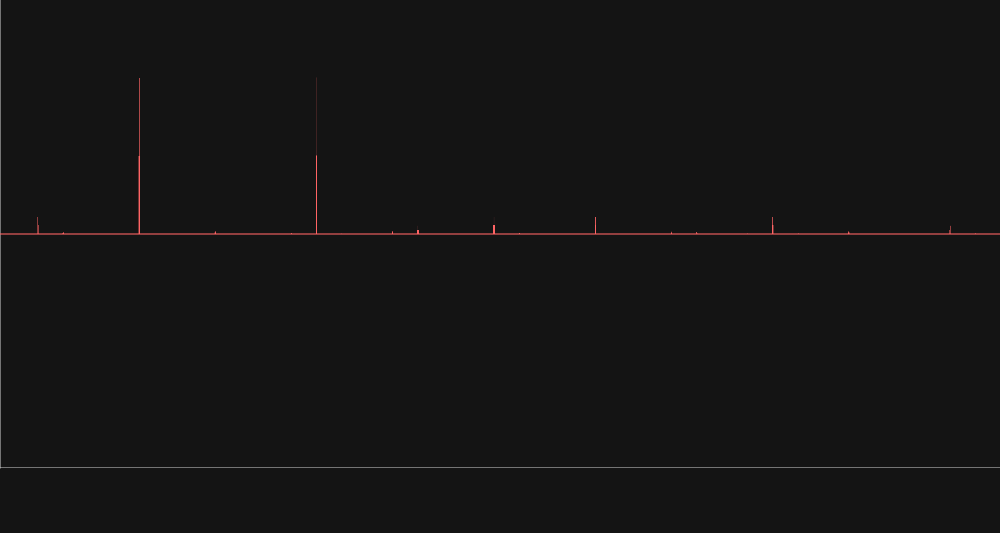

# Visualise Waves

- Fourier transform signal and visualise with [SDL3](https://github.com/libsdl-org/SDL)
- also using Emscripten to compile it so WASM

## Dependencies

- SDL3
- fftw3
- cmake

### Build

- cmake

```bash
mkdir build
cd build
cmake ..
make
```
- just gcc

```bash
gcc src/fft.c src/plot.c src/read_wav.c -I include -lSDL3 -lm -lfftw3 -o VisWav
```

## Usage

```bash
$: ./build/VisWav -h
Prints the WAV file samples
Usage: ./build/VisWav [OPTIONS] PATH_TO_WAV_FILE
OPTIONS:
        -s/--spectrum:  plot the spectrum instead
        -h/--help:      print this help
        -v/--verbose:   print additional info
        -p/--print:     print plotted values
```


## [readWAV](./src/readWAV.c)

```bash
$: ./build/VisWav ./example_wav/Sin440.wav
```


- simple program for reading and visualising a WAV file
- Mouse wheel to zoom

## [fft spectrum](./src/fft.c)
```bash
$: ./build/VisWav ./example_wav/Sin440_1000.wav
```


- also possible to show the signals spectrum

## Notes

- [WAV Header format](https://en.wikipedia.org/wiki/WAV:~:text=WAV%20file%20header)
- [RIFF and WAV reference (IBM/Microsoft)](https://www.aelius.com/njh/wavemetatools/doc/riffmci.pdf)
- [fftw tutorial](https://www.github.com/jonathanschilling/fftw_tutorial/)
